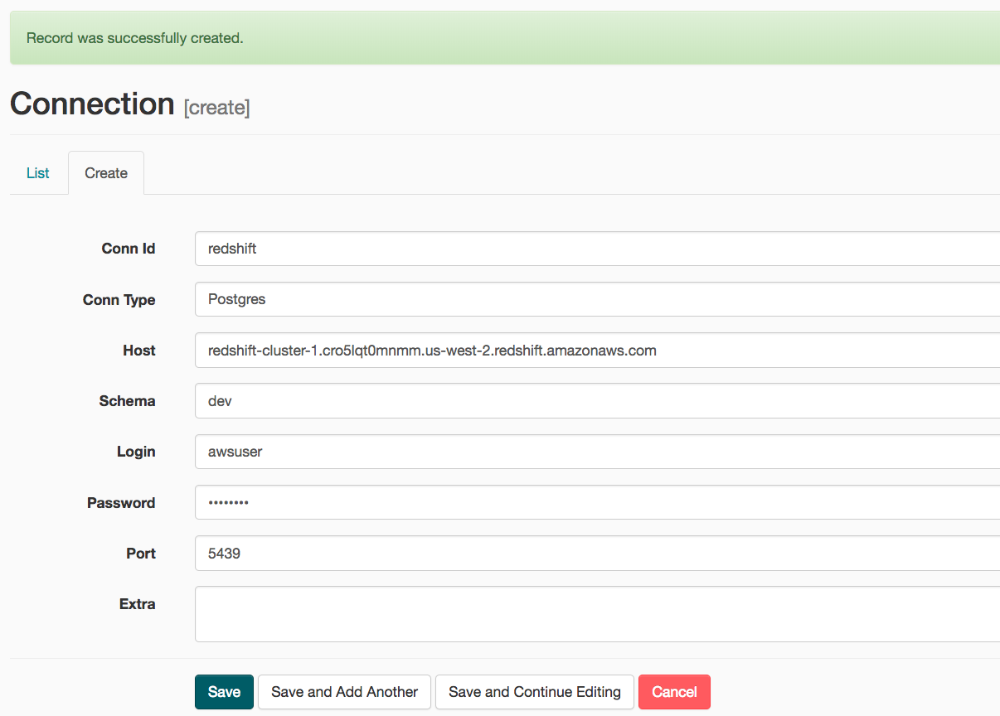
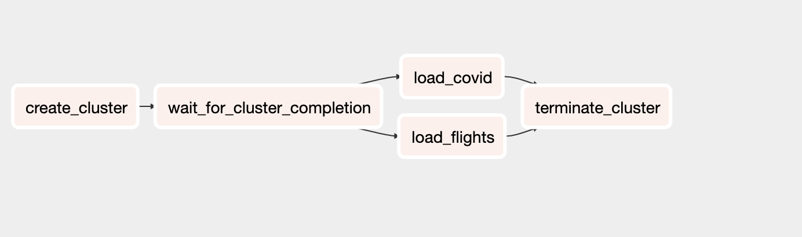
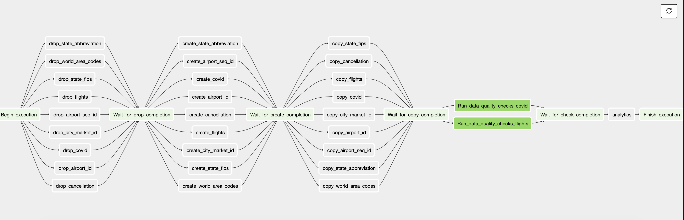

# Udactiy Capstone Project
The scope of the project is to provide a thorough analysis on the United States flights
affected by coronavirus.
For the project the following data sources were used:

* US flight information provided by [transtats](https://www.transtats.bts.gov/)
  The reports contain flight information for months January and Februrary 2020
* Corona virus data provided by [EU Open Data Portal](https://data.europa.eu/)
  The report contains up to date data for all global corona virus cases

The project makes use of the following technologies:
* Airflow
* Spark
* EMR
* Livy


The project is divided in two folders one containing the spark code used and one 
for the airflow work flows.
The spark code follows these guidelines [best practices writing production spark](https://developerzen.com/best-practices-writing-production-grade-pyspark-jobs-cb688ac4d20f)
and a makefile is used to zip all the jobs to a separate jobs.zip file. Same goes for all externally used libraries. Following
these practices it becomes easy to submit spark jobs passing the zips in the --py-files argument of spark-submit and all
required arguments via the --args. The spark job can be submitted independently and run locally
or used in combination with airflow, emr and livy to automate the process
For airflow a sample docker-compose is present in the airflow folder that boots up a local instance of airflow
and mounts the dags and plugins
## Installation
The following steps must be followed before running the project:
* Create IAM role for Redshift
* Create security group that will be attached to redshift
* Create the ElasticMapReduce-master & slave security groups
* Create Redshift cluster
* run the docker compose to boot airflow
```shell script
docker-compose -f docker-compose.yml up
```
* create spark distributable
```shell script
cd spark-covid
make build
```
This creates a /dist folder that contains the main.py and the jobs.zip and libs.zip
that must be provided alongside the main python script

## Configuration 

The following must be placed in the /airflow/dags/dwh.cfg:
```buildoutcfg
[CLUSTER]
DWH_ROLE_ARN=<myRedshiftRole>
[S3]
COVID_DATA=<s3_path_to_covid_parquet>
FLIGHTs_DATA=<s3_path_to_flights_parquet>
AIRPORT_ID=<s3_path_to_flights/L_AIRPORT_ID.csv>
AIRPORT_SEQ_ID=<s3_path_to)flights/L_AIRPORT_SEQ_ID.csv
CANCELLATION=<s3_path_to_flights/L_CANCELLATION.csv
MARKET_ID=<s3_path_to_flights/L_CITY_MARKET_ID.csv
STATE_FIPS=<s3_path_to_flights/L_STATE_FIPS.csv
WAC=<s3_path_to_flights/L_WORLD_AREA_CODES.csv
ABBR=<s3_path_to_flights/L_STATE_ABR_AVIATION.csv
INPUT_OUTPUT_DATA=<s3a://bucket>
PROJECT_PATH=<s3://bucket_of_spark_application>
```
e
The following connections must be created in airflow before enabling the dag

1) Setting a connection to the created redshift cluster
2) Setting a connection for the aws-credentials that have access to s3 (Alternatively an IAM role can be used)




## Database schema design and ETL process
The data that is being created first on parquet, being a file format
great for big data operations and then a fact and dimensions table is 
created and populated in redshift, where all the analytics queries can be run.
#### Database design
For the database the decision was made to create 7 dimension tables and 2 fact table (flights, covid )
* covid
* flights

And the dimension tables of flights that all contain the similar named columns:
code, description

* airport_id (Airport ID. An identification number assigned by US DOT to 
identify a unique airport. Use this field for airport analysis across a range of years because an airport can change its airport code and airport codes can be reused.)

* airport_seq_id (Airport Sequence ID. An identification number assigned by US DOT to identify a unique airport at a given point of time. Airport attributes, such as airport name or coordinates, may change over time.)
* cancellation (Specifies The Reason For Cancellation)
* city_market_id (City Market ID. City Market ID is an identification number assigned by US DOT to identify a city market. Use this field to consolidate airports serving the same city market.)
* state_abbreviation (Contains the state abbreviations)
* world_area_codes (Contains the world area codes)
* state_fips (state fips codes)


#### ETL
Airflow orchestrates all the pipeline jobs that consist of:

#####Spark EMR


the emr job is responsible for booting up an emr cluster
running the spark jobs (application files  are stored in s3)
and terminating the cluster when the job is finished (success or failure)

#####Redshift flow

* Drop the redshift tables if the exist
* Create the tables in redshift
* Copy the data from s3 to redshift into the  tables using the COPY commnand
* Run the quality checks
* Run some analytics on the data (dummy operator here, the actual queries were
run manually in this case)


#### Notes
Extra information on the models and spark transformations can be found 
in the following notebook:
spark-covid/research.ipynb 